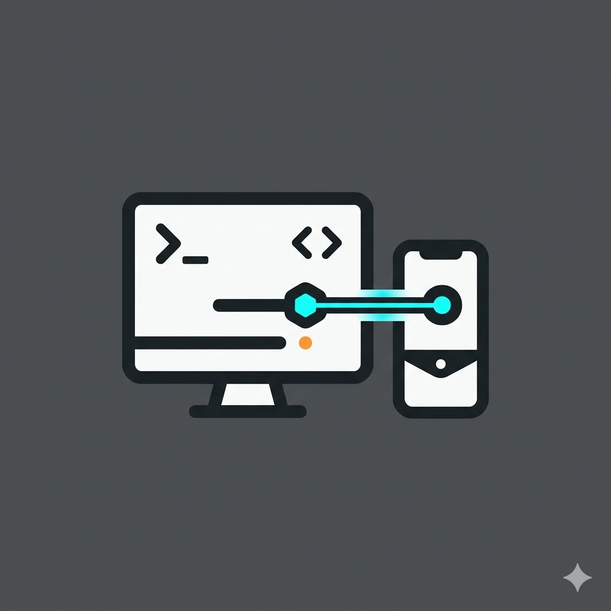

<p align="center">
  
</p>

<h1 align="center">Pocket-Codex</h1>

<p align="center">
  让 Codex 留在桌面继续工作，让手机成为随时可用的调度和确认面板。
</p>

<p align="center">
  <a href="README.md">English</a>
</p>

<p align="center">
  
</p>

Pocket-Codex 是一个基于 RustDesk 的“手机调度桌面 Codex”工作流。代码执行、项目文件、终端环境、凭据状态和 Codex CLI 都留在桌面；手机负责发起任务、查看进度、确认高风险操作和读取结果。

这个仓库是该工作流的公开产品分支。它不是通用远程桌面的替代品；上游 RustDesk 仍然是远程桌面基础，Pocket-Codex 在这个基础上增加 agent bridge、dashboard 和自建工作流。

## 适合谁

Pocket-Codex 面向这些使用者：

- 有长期在线的桌面、工作站或家庭服务器
- 已经在真实本地项目里使用 Codex CLI
- 希望离开电脑后，开发任务仍能继续推进
- 更希望在手机上做调度和确认，而不是在手机上完整开发
- 希望执行环境留在自己拥有或管理的机器上

如果只需要远程桌面，上游 RustDesk 是更合适的起点。如果目标是让可信桌面继续执行 Codex 工作，同时用手机做方向控制和审批，Pocket-Codex 是更聚焦的路径。

## 产品模型

手机是控制面板，桌面是执行者。

这意味着：

- 代码留在桌面
- Codex 在桌面运行
- 项目白名单在桌面执行
- 写入类操作可以要求确认
- Dashboard 以任务为中心，而不是把每次 agent 执行伪装成普通聊天
- 桌面 Codex session history 是会话恢复的事实来源

目标不是把手机塞成开发工作站，而是在用户离开键盘后，让真正的工作站继续有用。

## 核心流程

1. 在桌面端运行 Pocket-Codex。
2. 配置 Codex 可访问的本地项目。
3. 手机通过 RustDesk 传输链路连接桌面。
4. 打开 Agent Dashboard。
5. 选择项目、profile、session 和上下文。
6. 把任务发送到桌面。
7. 查看状态，在需要时确认写入类操作，并读取结果。

## 主要组件

### Codex Agent Bridge

Codex Agent Bridge 是桌面侧运行时，负责把远程会话连接到本地 Codex CLI 执行。

它提供：

- 被控桌面上的本地 bridge 服务
- 项目白名单检查
- read-only 和 workspace-write 执行模式
- 写入类任务的确认流程
- run、confirm、cancel 和 task status 处理
- 桌面 Codex session 列表、详情恢复和历史分页
- 面向 dashboard 恢复与续接的 task snapshot
- 用于 dashboard 同步的 bridge 增量事件
- 本地 skill catalog 接口
- 语音转录和语音运行路径
- 通过远程会话回传任务结果

主要代码：

- `src/agent_bridge.rs`
- `src/server/connection.rs`
- `libs/hbb_common/protos/message.proto`

### Agent Dashboard

Agent Dashboard 是面向手机端的 agent 任务工作区。

它提供：

- 项目、profile 和 session 控制
- 以任务为中心的会话空间
- 从桌面 Codex history 恢复 session
- 从同一套 bridge task source 恢复任务状态
- live web debug 和移动端 runtime 共享的 bridge-backed session/task 状态
- 可选的会话历史上下文
- 可选的终端 transcript 上下文
- running、confirmation、completed、failed 状态
- full-page 和 floating 两种 dashboard 开发模式

主要代码：

- `flutter/lib/models/agent_dashboard_model.dart`
- `flutter/lib/models/agent_dashboard_runtime_io.dart`
- `flutter/lib/models/agent_dashboard_runtime_web.dart`
- `flutter/lib/common/widgets/agent_dashboard_page.dart`
- `flutter/lib/common/widgets/agent_dashboard_dev_shell.dart`

## Web 优先开发

Dashboard 工作流优先走 Web。真正的 dashboard 实现位于 `flutter/lib/`，单独的 harness 只负责更快地验证布局、session restore、task state 和 bridge 行为，再进入移动端打包验证。

主要 harness：

- `tools/agent_dashboard_harness/`

常用命令：

```powershell
powershell -NoProfile -ExecutionPolicy Bypass -File tools/agent_dashboard_harness/run-web.ps1 -Mode floating
powershell -NoProfile -ExecutionPolicy Bypass -File tools/agent_dashboard_harness/run-web-live.ps1 -Mode floating
```

`run-web.ps1` 用于纯 mock UI 工作。`run-web-live.ps1` 会在 `127.0.0.1:17331` 启动本地 debug bridge，读取 `~/.codex` 里的真实桌面 Codex session，并把任务类请求代理到 `127.0.0.1:17321` 上的本地 Pocket-Codex bridge。

Web harness 是调试壳，不是第二套 dashboard 实现。共享 Dart dashboard 代码应继续留在 `flutter/lib/`，让浏览器验证和移动端打包消费同一套 model 与 widgets。

## 移动端与桌面端打包

Pocket-Codex 把公开品牌和兼容性敏感的内部标识分开处理。

当前公开品牌使用：

- Android 应用名：`Pocket-Codex`
- Android 无障碍服务名：`Pocket-Codex Input`
- iOS 和 macOS 显示名：`Pocket-Codex`
- Windows 产品元数据：`Pocket-Codex`
- 基于 Pocket-Codex 视觉标识的应用图标

部分底层标识会继续保持与 RustDesk 基座兼容，包括包名、可执行文件名、部分内部类名、驱动名、依赖 URL 和旧的 `rustdesk://` deep link scheme。支持的平台也会同时暴露新的 `pocket-codex://` scheme。

## 当前状态

Pocket-Codex 是正在推进中的原型，适合开发和受控测试，还不是打磨完成的公开发布版。

已经可用：

- 桌面 bridge 运行时
- bridge run / confirm / cancel / task status 流程
- 通过 RustDesk session 传输 agent 请求和结果
- dashboard model 和 dashboard UI shell
- Web mock harness 和 live desktop-session harness
- 桌面 Codex session 列表、详情恢复和历史分页
- 基于 bridge-backed task snapshot 的 dashboard 恢复
- bridge 增量事件进入 dashboard 同步路径
- 带 Pocket-Codex 品牌的 Android 和 Windows debug 打包
- bridge 检查、dashboard 开发、Windows 构建、Android 构建和自建部署相关脚本

仍在收口：

- 每个结果和恢复路径的 request-id 归属
- bridge 重启后的任务状态持久化
- 重复 push / poll 状态链路的收敛
- 长 session history restore 的性能
- 语音输入和 STT 打磨
- 面向公开用户的 onboarding
- 发布级打包

## 仓库导览

阅读 Pocket-Codex 产品逻辑时，建议从这些位置开始：

- `src/agent_bridge.rs`
- `src/server/connection.rs`
- `libs/hbb_common/protos/message.proto`
- `flutter/lib/models/agent_dashboard_model.dart`
- `flutter/lib/models/agent_dashboard_runtime_io.dart`
- `flutter/lib/models/agent_dashboard_runtime_web.dart`
- `flutter/lib/common/widgets/agent_dashboard_page.dart`
- `tools/agent_dashboard_harness/`
- `tools/restart-rustdesk-from-source.ps1`
- `agent/codex-bridge/scripts/`

当前文档：

- [项目介绍](docs/project-introduction-zh.md)
- [技术状态](docs/voice-codex-agent-tech-status-zh.md)
- [Dashboard 状态](docs/voice-codex-agent-dashboard-status-zh.md)
- [Dashboard 开发调试流](docs/agent-dashboard-dev-flow-zh.md)
- [Dashboard 优化基线](docs/agent-dashboard-optimization-baseline-zh.md)
- [Dashboard 优化审计](docs/agent-dashboard-optimization-audit-zh.md)
- [任务状态气泡方案](docs/agent-dashboard-task-status-bubble-tech-plan-zh.md)
- [本地 Agent 配置](docs/local-agent-configuration-zh.md)
- [自建服务配置](docs/rustdesk-selfhosted-status-zh.md)

## Dashboard 开发规则

保持一条权威边界：

- 桌面 bridge 负责 Codex session history、session paging 和 task snapshot
- dashboard 本地持久化只负责 drafts、pins、archive state、selected profile 和临时视图状态等 UI 元数据
- 后续同步能力应优先扩展 bridge-fed session/task 数据或 bridge 增量事件，而不是增加另一套 transcript store

推荐本地回路：

1. 用 `run-web.ps1` 在 mock 模式下迭代 UI。
2. 用 `run-web-live.ps1` 验证真实 session 和 task state。
3. 共享 Dart 改动验证后，再重打移动端包。
4. Rust bridge 有改动后，刷新已安装的桌面运行时。
5. 优化证据记录在 baseline/audit 文档中，不把 README 写成变更日志。

## 信任与安全

Pocket-Codex 只应运行在用户拥有或被授权管理的机器上。

当前设计把敏感执行留在桌面：

- 项目路径在本地配置
- Codex 凭据留在桌面
- 可写执行可以要求确认
- bridge 执行范围限制在配置项目内

远程访问软件存在被滥用的风险。不要把 Pocket-Codex 用于未授权访问、监控或控制不属于你或你无权管理的系统。

## 与上游的关系

这个仓库基于 [rustdesk/rustdesk](https://github.com/rustdesk/rustdesk)。

RustDesk 仍然是远程桌面基础能力的上游来源。Pocket-Codex 在这个基础上构建一条独立的“手机调度桌面 Codex”产品路径。

上游 RustDesk：

- [上游仓库](https://github.com/rustdesk/rustdesk)
- [官方构建文档](https://rustdesk.com/docs/en/dev/build/)
- [RustDesk Server](https://rustdesk.com/server)

## 贡献方向

最有价值的贡献，是让“手机调度桌面 agent”工作流更容易运行、更安全可信或更容易理解。

适合优先参与的方向：

- bridge 协议收敛
- dashboard 任务流收敛
- 长任务的移动端 UX
- 安装和配置自动化
- 自建服务部署文档
- 围绕路由、确认、取消、session restore 和结果归属的测试

除非直接服务 Pocket-Codex 工作流，否则不建议做大范围上游 RustDesk 重构。这个分支应保持对“手机控制桌面 agent”产品路径的聚焦。
