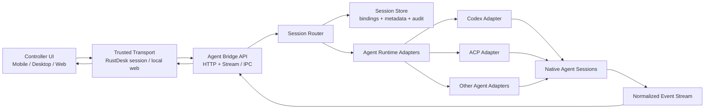

# Agent Bridge v2 参考设计提炼

更新时间：2026-06-08

## 背景

本文件从 MindFS 这类本机 Agent 网关项目中提炼 Agent Bridge v2 的通用设计方向，用于指导后续架构演进。

本文件不是 MindFS 代码移植方案。MindFS 使用 AGPL v3，后续只能借鉴架构边界、协议形态和产品能力，不应直接复制实现代码到 RustDesk fork。

## v2 目标

Agent Bridge v2 要从“一次性命令执行器”升级为“本机 Agent 会话网关”：

1. 将手机、Web、桌面 UI 的请求统一路由到受控机器上的本机 Agent。
2. 将 Codex、Claude、ACP 类 Agent 的差异封装在 adapter 内。
3. 将底层 Agent 会话 ID 与上层 UI conversation 持久绑定。
4. 将 token、工具调用、确认请求、任务状态、上下文窗口等事件结构化推送给 UI。
5. 让会话历史以底层 Agent 线程为权威源，避免多端各自保存一份互相漂移的聊天记录。

## 核心原则

### 1. Bridge 是 sidecar，不是远控内核

Bridge 运行在被控桌面本机，负责 Agent 业务复杂度。远控内核只负责可信传输、设备身份和消息路由。

这样可以保持远控能力稳定，也便于未来替换 Codex adapter、扩展多 Agent、独立调试和审计。

### 2. 会话权威源必须单一

UI 可以维护 conversation 容器、草稿、过滤器、置顶和本地展示状态，但 transcript 的长期权威源应逐步收敛到底层 Agent session。

v2 需要显式维护：

- `conversation_id`
- `request_id`
- `agent_name`
- `agent_session_id`
- `project_id`
- `agent_ctx_seq` 或等价的同步游标

### 3. 协议必须结构化

v1 里的文本命令和同步 HTTP 返回适合验证闭环，但不适合作为长期协议。

v2 必须把请求、取消、确认、状态、流式事件和会话导入拆开表达，避免继续把所有语义塞进一段聊天文本。

### 4. 流式优先，轮询兜底

理想主链路是 WebSocket、远控消息流或等价事件通道。HTTP task snapshot 可以保留为断线恢复和调试兜底。

UI 不应只等待最终文本，而应能显示：

- started
- message chunk
- thought chunk
- tool call started
- tool call updated
- ask user
- context window
- done
- failed
- cancelled
- recovery

### 5. 安全默认只读

默认模式应为 read-only。任何文件写入、删除、移动、命令执行、提交、部署、外部网络敏感操作都必须进入显式确认流。

确认请求不应只是一个字符串 token，而应包含风险摘要、目标项目、预计动作、受影响文件和可审计上下文。

## 推荐架构



## 模块拆分

### Bridge API

Bridge API 负责对 UI 和远控传输暴露稳定协议：

- 创建或恢复会话
- 发送消息
- 取消当前 turn
- 回答确认问题
- 查询 task snapshot
- 列出外部 Agent sessions
- 导入外部 session
- 查询会话详情和分页历史
- 列出项目、skills、runtime 状态

### Session Router

Session Router 负责把上层请求映射到底层 Agent session：

- 已绑定 `agent_session_id` 时优先恢复
- 没有绑定时按 project / agent / model 创建新 session
- Agent 或模型切换时记录新的绑定状态
- bridge 重启后按持久化绑定恢复

### Agent Runtime Adapter

每个 adapter 对内实现统一接口，对外隐藏 Agent 差异：

- `SendMessage`
- `CancelCurrentTurn`
- `AnswerQuestion`
- `CurrentModel`
- `SetModel`
- `ListModels`
- `ListModes`
- `ListCommands`
- `ContextWindow`
- `SubscribeThreadEvents`
- `ImportExternalSession`

### Session Store

Session Store 至少需要保存：

- session meta
- agent binding
- exchange index
- tool / thought / ask-user auxiliary events
- related files
- task snapshots
- audit log

存储可以是 SQLite + JSONL，也可以先用 JSONL 起步，但要避免只靠进程内内存表。

### Event Normalizer

不同 Agent 的事件字段不同，UI 不应直接理解各家 SDK 的原始事件。

Bridge 应输出统一事件类型：

```json
{
  "type": "tool_call",
  "session_id": "agent-session-id",
  "data": {
    "id": "tool-call-id",
    "kind": "edit",
    "status": "running",
    "title": "Edit src/app.rs",
    "locations": [{ "path": "src/app.rs", "line": 42 }]
  }
}
```

## 协议草案

### Run

```json
{
  "request_id": "uuid",
  "conversation_id": "ui-conversation-id",
  "project_id": "rustdesk",
  "agent": "codex",
  "model": "gpt-5",
  "mode": "read-only",
  "agent_session_id": "optional-existing-session",
  "prompt": "继续分析 bridge v2 方案",
  "context": {
    "include_history": true,
    "include_terminal": false,
    "attachments": []
  }
}
```

### Stream Event

```json
{
  "type": "session.stream",
  "payload": {
    "request_id": "uuid",
    "conversation_id": "ui-conversation-id",
    "project_id": "rustdesk",
    "agent_session_id": "native-session-id",
    "event": {
      "type": "message_chunk",
      "data": { "content": "..." }
    }
  }
}
```

### Task Snapshot

```json
{
  "request_id": "uuid",
  "conversation_id": "ui-conversation-id",
  "project_id": "rustdesk",
  "status": "running",
  "agent": "codex",
  "agent_session_id": "native-session-id",
  "summary": "Editing docs",
  "updated_at": "2026-06-08T00:00:00Z"
}
```

## 会话同步策略

v2 需要支持三类同步：

1. **外部导入**：扫描 Codex CLI、Claude 或 ACP runtime 的既有会话，导入 UI 可读索引。
2. **绑定恢复**：UI conversation 和底层 Agent session 建立绑定，bridge 重启后仍能继续同一 session。
3. **增量同步**：任务完成或 UI 打开会话时，按 cursor / timestamp 导入新增 exchange，而不是全量重建。

## 安全边界

v2 默认安全规则：

- bridge 默认只监听本机或受控 IPC。
- 远端访问必须经过 RustDesk 已建立的设备信任链。
- project 必须在白名单内。
- read-only 是默认模式。
- workspace-write 需要显式确认。
- task / tool / file change 必须写审计日志。
- 输出要做长度截断，完整日志留在受控端本机。
- credentials 和 Agent 配置备份需要单独权限，不应混入普通 run 请求。

## 分阶段落地

### Phase A：接口抽象

- 定义统一 session、event、task、binding 模型。
- 保留现有 v1 HTTP 和 AgentCommand 兼容入口。
- 新增内部 adapter trait / interface。

### Phase B：Codex adapter

- 优先验证可恢复 Codex thread。
- 将现有 `codex exec` 保留为 fallback。
- 输出统一 stream events 和 task snapshot。

### Phase C：持久化绑定

- 新增 binding store。
- conversation 与 `agent_session_id` 双向查询。
- 支持 bridge 重启后继续。

### Phase D：UI 实时化

- Agent Dashboard 消费 stream event。
- task status bubble、timeline、tool card 只消费统一事件。
- HTTP polling 退为恢复路径。

### Phase E：多 Agent

- Codex 稳定后再接 ACP / Claude 类 adapter。
- 多 Agent 切换必须继续维护同一 conversation 的同步边界。

## 不做的事

- 不把 AGPL 项目的代码并入 RustDesk。
- 不把 Agent runtime 深埋进远控连接管理代码。
- 不让手机直接访问被控桌面的 `127.0.0.1`。
- 不继续扩展聊天文本命令作为长期协议。
- 不默认给语音命令写权限。

## 验收标准

1. 同一 conversation 可以绑定并恢复同一 Codex thread。
2. bridge 重启后，后续消息仍能继续同一底层 session。
3. UI 能实时显示 message、tool、ask-user、done、failed。
4. 任务完成后，conversation transcript 与桌面 Codex session 一致。
5. 断线恢复时，可通过 task snapshot 和 session import 还原 UI 状态。
6. 普通远控、聊天、文件传输不受 Agent Bridge v2 改造影响。
