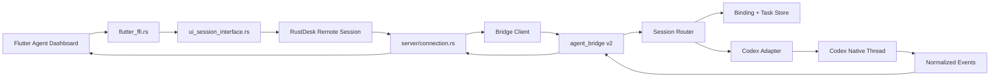

# RustDesk Agent Bridge v2 设计文档

更新时间：2026-06-08

## 目标

本文件将 `Agent Bridge v2` 参考设计落到当前 RustDesk fork 的实际代码和迭代路径上。

目标不是重做一个 MindFS，也不是把 Agent 功能塞进 RustDesk 远控核心，而是在现有 Pocket Codex / Agent Dashboard 基础上，把 bridge 从 `codex exec` 任务执行器升级成可恢复、可流式、可审计的本机 Agent 会话网关。

## 当前项目基线

当前主链路已经可用：

```text
Flutter Agent Dashboard
-> sessionSendAgentCommand
-> src/flutter_ffi.rs
-> src/ui_session_interface.rs
-> src/server/connection.rs
-> src/agent_bridge.rs
-> local Codex CLI
-> AgentResult
-> Flutter AgentDashboardModel
```

当前已有能力：

- 结构化 `AgentCommand` / `AgentCancel` / `AgentResult` protobuf。
- 本机 bridge：`/agent/run`、`/agent/tasks/:id`、`/agent/confirm`、`/agent/cancel`。
- Codex session list/detail/page 读取。
- Flutter `AgentDashboardModel` 的 `sessionRef`、`requestId`、task snapshot、history hydration。
- Web harness 的 mock/live 双调试路径。
- voice transcribe / voice run 的 bridge API 骨架。

当前主要短板：

- bridge 执行层仍以 `codex exec` 子进程为主。
- 任务状态主要靠同步返回和 task polling，不是真正流式事件。
- `sessionRef` 能绑定真实 Codex session，但底层 native session 还不是完整的长期会话对象。
- Flutter conversation 仍保存部分本地消息状态，Codex session 还不是唯一 transcript 权威源。
- `/agent`、`/agent-confirm`、`/agent-cancel` 兼容命令仍然存在。

## v2 设计边界

### RustDesk 远控层

RustDesk 远控层继续负责：

- 设备身份和可信连接。
- 控制端与被控端之间的消息传输。
- `AgentCommand`、`AgentCancel`、`AgentResult`、未来 `AgentStreamEvent` 的转发。
- 兼容旧客户端和普通聊天。

RustDesk 远控层不负责：

- 解析 Codex 原始事件。
- 管理 Agent SDK 生命周期。
- 保存长期 Agent transcript。
- 直接处理模型、profile、skills、tool call 细节。

### Agent Bridge 层

`src/agent_bridge.rs` 或后续拆出的 `src/agent_bridge/*` 负责：

- 项目白名单。
- task lifecycle。
- Codex adapter。
- session binding。
- session history import。
- audit log。
- stream event normalizer。
- voice/STT 后端调用。

## 推荐 v2 架构



## 数据模型

### ConversationRoute

Flutter 侧现有 `projectId / threadMode / sessionRef / profile / selectedSkillIds` 可以保留，但 v2 要把它映射成稳定 route：

```json
{
  "conversation_id": "dashboard-conversation-id",
  "project_id": "rustdesk",
  "project_path": "E:\\rustDesk",
  "agent": "codex",
  "profile": "default",
  "thread_mode": "continue",
  "agent_session_id": "codex-thread-id",
  "selected_skill_ids": []
}
```

### AgentBinding

bridge 侧新增持久化绑定：

```json
{
  "conversation_id": "dashboard-conversation-id",
  "project_id": "rustdesk",
  "agent": "codex",
  "agent_session_id": "codex-thread-id",
  "agent_ctx_seq": 42,
  "updated_at": "2026-06-08T00:00:00Z"
}
```

第一版可以存在 bridge data dir 的 JSONL 或 SQLite；如果后续 task / session 都要持久化，建议直接使用 SQLite。

### AgentStreamEvent

建议在现有 `AgentResult` 之外增加轻量流式事件。可以先走 `detail_json` 兼容，稳定后再进 protobuf：

```json
{
  "request_id": "uuid",
  "conversation_id": "dashboard-conversation-id",
  "project": "rustdesk",
  "agent_session_id": "codex-thread-id",
  "event": {
    "type": "tool_call",
    "data": {
      "id": "tool-id",
      "kind": "edit",
      "status": "running",
      "title": "Edit docs/rustdesk-agent-bridge-v2-design-zh.md"
    }
  }
}
```

## Codex adapter 策略

### Adapter 优先级

1. **Codex native thread adapter**
   - 目标：可创建、恢复、订阅同一个 Codex thread。
   - 输入：project path、model、profile、agent_session_id、prompt。
   - 输出：统一 `AgentStreamEvent`。

2. **Codex exec fallback**
   - 保留当前稳定路径。
   - 用于 SDK 不可用、登录状态异常、app-server 接口变化时兜底。
   - 继续支持 `resume --last` 和 `resume <session>`。

3. **Session file importer**
   - 继续读取 `~/.codex/session_index.jsonl` 和 `~/.codex/sessions/**/*.jsonl`。
   - 作为 UI hydration、断线恢复、外部 CLI 会话导入的权威数据读取路径。

### 不做硬依赖

Codex SDK / app-server 接口稳定前，不应让 RustDesk 主链路硬依赖它。v2 应通过 adapter feature flag 切换：

```text
codex-bridge-runtime = exec | native | auto
```

默认可以是 `auto`：

- native 可用：使用 native thread。
- native 不可用：回退到 exec。
- exec 失败：返回明确错误和修复建议。

## 协议演进

### 当前 protobuf 保留

现有字段继续有效：

- `AgentCommand`
- `AgentCancel`
- `AgentResult`

这保证旧 Dashboard、旧远控入口和现有测试不会被一次性破坏。

### v2 增量字段

后续可向 `AgentCommand` 增加：

- `conversation_id`
- `agent`
- `profile`
- `session_id`
- `selected_skill_ids`
- `context_flags`

向 `AgentResult` 增加或通过 `detail_json` 标准化：

- `agent_session_id`
- `conversation_id`
- `event_type`
- `task_snapshot`
- `stream_events`

如果流式事件稳定，再新增独立消息：

```proto
message AgentStreamEvent {
  string request_id = 1;
  string conversation_id = 2;
  string project = 3;
  string agent = 4;
  string agent_session_id = 5;
  string event_type = 6;
  string event_json = 7;
}
```

## API 演进

### 保留现有 API

- `POST /agent/run`
- `POST /agent/cancel`
- `POST /agent/confirm`
- `GET /agent/tasks/:id`
- `GET /agent/sessions`
- `GET /agent/sessions/:id`
- `GET /agent/sessions/:id/page`

### 新增 v2 API

建议新增版本化路径，避免破坏现有 harness：

```text
POST /agent/v2/sessions/open
POST /agent/v2/sessions/:session_key/message
POST /agent/v2/sessions/:session_key/cancel
POST /agent/v2/sessions/:session_key/answer
GET  /agent/v2/sessions/:session_key/stream
GET  /agent/v2/bindings
GET  /agent/v2/tasks/:request_id
```

如果短期不做 WebSocket，可以先用 server-sent event 或远控消息推送；Web harness 可先接 HTTP polling 兼容。

## Flutter Dashboard 改造点

### AgentDashboardRuntime

现有 runtime interface 保留，但新增能力：

- `openOrResumeAgentSession`
- `sendAgentMessage`
- `cancelAgentTurn`
- `answerAgentQuestion`
- `subscribeAgentEvents`
- `syncExternalSession`

短期实现可以仍包在 `dispatchEnvelope()` 内，先让 model 消费标准化 detail_json。

### AgentDashboardModel

后续要收敛三个职责：

1. `requestId -> conversationId`
2. `conversationId -> agentSessionId`
3. `agentSessionId -> transcript hydration cursor`

当前 `restoreSessionIntoConversation()`、`_applySessionDetail()`、`requestTaskStatus()` 已经是 v2 的主要落点，但要减少重复扫描和副作用，让它们分别承担：

- 绑定 route
- 读取 session detail
- 合并 messages
- 更新 task 状态

### UI 展示

v2 UI 不再只展示最终文本，应逐步增加：

- live reply chunk
- tool call card
- ask-user confirmation card
- context window indicator
- task status bubble
- related files list
- session import / resume selector

## 持久化设计

### 第一阶段：轻量 JSONL

新增 bridge data 文件：

```text
codex-bridge-bindings.jsonl
codex-bridge-tasks.jsonl
codex-bridge-events.jsonl
```

优点是改动小，容易审计。缺点是查询和去重会越来越重。

### 第二阶段：SQLite

当 v2 stream 和 binding 稳定后，迁移到 SQLite：

```sql
sessions(session_key, conversation_id, project_id, agent, name, created_at, updated_at)
agent_bindings(session_key, conversation_id, agent, agent_session_id, agent_ctx_seq, updated_at)
tasks(request_id, session_key, project_id, status, summary, updated_at)
events(request_id, session_key, seq, event_type, event_json, created_at)
```

## 安全策略

v2 继续沿用当前保守边界：

- bridge 只监听 `127.0.0.1` 或本机 IPC。
- 移动端不直接访问桌面 `127.0.0.1`。
- 手机请求必须走 RustDesk 已建立远控 session。
- project 必须白名单。
- 默认 `read-only`。
- `workspace-write` 必须确认。
- 语音命令默认先转写、预览、确认，再执行。
- audit log 记录 device、project、request、mode、agent_session_id、结果和错误。

## 分阶段计划

### Phase 1：v2 binding store

目标：先解决“手机 conversation 和桌面 Codex thread 一致”的根问题。

交付：

- 新增 bridge binding store。
- task done 后稳定写入 `conversation_id -> agent_session_id`。
- bridge 重启后可通过 binding 找回。
- Flutter `sessionRef` 从 transient 字段升级为 binding 显示结果。

验收：

- 同一 conversation 连续发送两次，第二次继续同一个 Codex session。
- bridge 重启后继续发送，仍能恢复同一 session 或给出明确 fallback。

### Phase 2：Codex native adapter spike

目标：验证可恢复、可流式的 Codex native thread。

交付：

- 新增 adapter trait。
- 接入 Codex native/app-server 路径的实验实现。
- 保留 exec fallback。
- 输出标准化 event JSON。

验收：

- 可以创建新 thread。
- 可以 resume 指定 thread。
- 可以拿到 message chunk、tool event、done / failed。
- native 不可用时自动回退 exec。

### Phase 3：stream event 到 Dashboard

目标：让 UI 不再只靠最终 result 和 polling。

交付：

- Bridge 产生 stream event。
- RustDesk 远控链路转发 event。
- Flutter model 消费 event 更新 timeline。
- task status bubble 消费同一事件源。

验收：

- 长任务运行中 UI 有进度。
- 工具调用能显示为结构化卡片。
- 断线后 task snapshot 能恢复当前状态。

### Phase 4：session authority 收敛

目标：Codex session 成为 transcript 权威源。

交付：

- 发送后按 `agent_session_id + cursor` 增量同步。
- 本地 conversation 只保存 UI 元数据和缓存。
- `restoreSessionIntoConversation()` 拆分职责。

验收：

- 手机端显示内容与桌面 Codex session 一致。
- 切换设备后仍能恢复同一 session。
- 本地 conversation 文件删除后仍可从 Codex session 恢复主要历史。

### Phase 5：voice v2

目标：语音成为同一 Agent session 的输入方式，而不是旁路。

交付：

- Android 录音采集闭环。
- 音频通过远控 AgentCommand envelope 到被控端。
- 桌面 STT 输出 transcript。
- transcript 预览和确认后进入同一 `sendAgentMessage`。

验收：

- 手机按住说话后，桌面 Codex 在当前 project/session 继续工作。
- 转写失败、STT 未配置、模型缺失都有明确提示。

## 需要避免的方向

- 不直接合并 MindFS AGPL 代码。
- 不重写整个 Agent Dashboard。
- 不让 v2 一次性替换所有 v1 API。
- 不把 `src/server/connection.rs` 变成 Agent 业务实现文件。
- 不继续把 `/agent ...` 文本命令当主协议扩展。
- 不为了流式体验牺牲 session 恢复和审计。

## 回归清单

每一阶段完成后至少验证：

1. 普通远控连接仍可用。
2. 普通聊天仍可用。
3. `sessionSendAgentCommand` 仍可触发 bridge。
4. `AgentResult` 仍能进入 `handleAgentResultEvent()`。
5. `GET /agent/sessions` 和 detail/page 仍可用。
6. task status polling 仍可兜底。
7. Web harness mock/live 仍能启动。
8. 旧 `/agent` 命令仍作为兼容路径保留，直到明确下线。

## 推荐下一步

优先做 Phase 1 和 Phase 2 的设计落地，不先动 UI 大改：

1. 为 bridge 新增 binding store 设计和最小实现。
2. 在 `AgentResult.detail_json` 中标准化输出 `conversation_id`、`agent_session_id`、`task_snapshot`。
3. 抽出 Codex runtime adapter trait。
4. 做 native Codex adapter spike，失败则继续 exec fallback。
5. 再让 Dashboard 消费 stream event。
