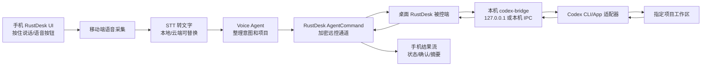

# RustDesk 语音到 Codex Agent 改造蓝图

## 目标

把 RustDesk 改造成一个适合“手机远程开着，语音驱动桌面 agent 工作”的客户端：

1. 手机端在远控会话中录音或按住说话。
2. 语音被转成文字，进入一个语音 agent 做意图整理、项目选择和安全确认。
3. 桌面端 Windows/macOS 上的本机 agent 接收指令，在指定项目里调用 Codex。
4. Codex 的执行状态、最终结果、必要确认项回传到手机端。

这不是把 Codex 直接塞进 RustDesk 内核，而是在 RustDesk 远控链路旁边增加一个受控的“agent 指令通道”。

## 当前 RustDesk 可复用能力

本仓库已经有几块可以直接复用：

- Flutter UI：`flutter/lib/mobile/`、`flutter/lib/desktop/` 是当前 UI 主线。
- Rust 核心会话：`src/ui_session_interface.rs` 负责控制端会话发送，`src/server/connection.rs` 负责被控端接收与连接管理。
- 文字聊天：协议里 `ChatMessage` 是 `Misc` 的一员，可从控制端发到被控端。
- 语音通话/录音基础：Android 已有 `RECORD_AUDIO` 权限和 `AudioRecordHandle`。
- 远程终端：仓库已经有 `TerminalAction`/`TerminalResponse` 和移动端终端页面，可作为后续“直接命令行调试”的兜底入口。
- 本机 IPC：`src/ipc.rs` 已有连接管理进程和 UI/服务进程之间的数据枚举。

关键代码入口：

- `libs/hbb_common/protos/message.proto`: `ChatMessage` 当前只有 `text` 字段；`Misc` 当前把 `chat_message = 4` 放在远控消息里。
- `src/ui_session_interface.rs`: `send_chat()` 把文字包装成 `Misc(ChatMessage)` 后发送。
- `flutter/lib/models/chat_model.dart`: `send()` 调用 `bind.sessionSendChat()` 或 `bind.cmSendChat()`。
- `src/server/connection.rs`: 连接管理侧把 `ipc::Data::ChatMessage` 转成远控消息；被控端收到 `Misc(ChatMessage)` 后转给 CM。

## 推荐架构



### 为什么不直接复用聊天

聊天可以做第一天的验证，但不应该作为长期协议：

- 聊天是人类消息，缺少 `request_id`、项目、状态、确认、错误、权限等级。
- agent 结果需要流式状态和可恢复任务，聊天字段太薄。
- 手机语音可能触发文件修改、命令执行、提交代码，必须有显式安全边界。

所以 MVP 可以用特殊前缀验证，例如 `/agent ...`，但正式实现要新增协议消息。

## 协议设计

在 `libs/hbb_common/protos/message.proto` 增加专用消息。不要改掉已有 `ChatMessage`，避免破坏兼容。

建议字段：

```proto
message AgentCommand {
  string request_id = 1;
  string transcript = 2;
  string normalized_prompt = 3;
  string target_project = 4;
  string target_profile = 5;
  AgentCommandMode mode = 6;
  bool require_confirmation = 7;
}

enum AgentCommandMode {
  AGENT_COMMAND_MODE_DRY_RUN = 0;
  AGENT_COMMAND_MODE_EXEC = 1;
  AGENT_COMMAND_MODE_REVIEW = 2;
  AGENT_COMMAND_MODE_STATUS = 3;
}

message AgentResult {
  string request_id = 1;
  AgentResultStatus status = 2;
  string text = 3;
  string detail_json = 4;
}

enum AgentResultStatus {
  AGENT_RESULT_STATUS_STARTED = 0;
  AGENT_RESULT_STATUS_NEEDS_CONFIRMATION = 1;
  AGENT_RESULT_STATUS_RUNNING = 2;
  AGENT_RESULT_STATUS_DONE = 3;
  AGENT_RESULT_STATUS_FAILED = 4;
  AGENT_RESULT_STATUS_CANCELLED = 5;
}
```

然后把它们挂到 `Misc.oneof` 后面，使用新的 tag，例如 `agent_command = 39`、`agent_result = 40`。正式改动还要重新生成 Rust/Flutter bridge 绑定。

## 桌面端 codex-bridge

建议新增独立小服务，而不是把 Codex 调用写死在 RustDesk 连接代码里。

职责：

- 只监听本机：Windows 用 `127.0.0.1` HTTP/WebSocket 或 named pipe，macOS 用 Unix socket/localhost。
- 维护项目白名单，例如 `<PROJECT_PATH>`、`~/work/foo`。
- 把 `AgentCommand` 映射成 Codex 调用。
- 捕获 stdout/stderr、最后消息、任务状态并回传。
- 负责速率限制、取消、审计日志和敏感命令确认。

当前机器能找到 `codex` 命令，非交互 MVP 可以这样执行：

```powershell
codex exec --cd <PROJECT_PATH> --sandbox workspace-write --output-last-message result.txt "用户语音转写后的任务"
```

更保守的默认值：

```powershell
codex exec --cd <PROJECT_PATH> --sandbox read-only --output-last-message result.txt "先分析并给出计划，不修改文件"
```

执行类任务必须让手机端二次确认，再切到 `workspace-write`。不要默认使用 `danger-full-access`。

## RustDesk 内改造点

### 1. 手机端 UI

入口建议放在远控页面工具栏或聊天面板旁边：

- `flutter/lib/mobile/pages/remote_page.dart`
- `flutter/lib/common/widgets/toolbar.dart`
- `flutter/lib/models/chat_model.dart` 可参考聊天发送逻辑

第一版交互：

- 长按录音，松开发送。
- 先显示转写文字，让用户点“发送给 agent”。
- 支持选择目标设备、目标项目、执行模式：分析、执行、查看状态。

### 2. 移动端语音采集

Android 现在已经有：

- `flutter/android/app/src/main/AndroidManifest.xml` 中的 `RECORD_AUDIO`
- `flutter/android/app/src/main/kotlin/com/carriez/flutter_hbb/AudioRecordHandle.kt`

但现有代码主要服务远控音频/语音通话。建议为 agent 录音单独封装：

- 不复用远控音频流的长生命周期。
- 录短音频片段，输出 wav/pcm/opus。
- 由 Flutter 调 MethodChannel 或 Dart 录音插件拿到文件/字节。

### 3. 语音识别

先做可替换接口：

```dart
abstract class SpeechToTextProvider {
  Future<String> transcribe(File audioFile, Locale locale);
}
```

可选实现：

- 本地 whisper.cpp/whisper.rn：隐私好，端上成本高。
- 云端 STT：速度快，但要处理密钥和隐私。
- 桌面端 STT：手机只传音频给桌面，被控机转写，适合你自己的 PC/Mac。

MVP 建议从“手机端先转文字再发”开始，调试最简单；隐私版再改成“手机传音频到桌面转写”。

### 4. Rust 核心消息

控制端发送：

- 在 `src/ui_session_interface.rs` 增加 `send_agent_command()`。
- 在 `src/flutter_ffi.rs` 暴露 `session_send_agent_command()` 给 Flutter。

被控端接收：

- 在 `src/server/connection.rs` 的 `Misc` 分支处理 `AgentCommand`。
- 转发给本机 `codex-bridge`。
- bridge 回调时发送 `AgentResult` 给控制端。

控制端结果展示：

- 在 `src/client/io_loop.rs` 处理 `AgentResult`。
- 通过 `src/flutter.rs` push event 给 Flutter。
- Flutter 里新增 `AgentModel` 管理任务列表和状态流。

## MVP 分阶段

### Phase 0：不改协议，验证闭环

目标：证明“手机文字 -> 桌面 Codex -> 手机结果”能跑通。

做法：

1. 手机端先在聊天框发送 `/agent project=<PROJECT_ID> mode=dry-run ...`。
2. 被控端在 `src/server/connection.rs` 收到 `ChatMessage` 后识别 `/agent` 前缀。
3. 调本机 `codex-bridge`。
4. bridge 结果用普通 `ChatMessage` 回发。

优点是改动小；缺点是协议不干净。只建议用于验证。

### Phase 1：正式 AgentCommand 协议

目标：把 agent 指令从聊天中剥离。

交付：

- `AgentCommand`/`AgentResult` protobuf。
- Flutter FFI 绑定。
- 手机端 agent 面板。
- 桌面端 bridge 调用和结果回传。
- 项目白名单配置。

### Phase 2：语音体验

目标：把文字输入换成语音优先。

交付：

- 按住说话。
- 转写预览。
- 口语转任务 prompt。
- 执行前确认。
- 任务状态推送。

### Phase 3：Codex App 深度集成

目标：对接你习惯的 Codex App 项目/线程。

优先顺序：

1. Codex CLI `exec`/`resume`，稳定可脚本化。
2. Codex `app-server`/远程 websocket，如果后续接口足够稳定。
3. 桌面 UI 自动化作为最后兜底，不作为主路径。

## 安全边界

必须默认启用：

- 设备配对后才允许 agent 指令。
- 项目白名单，不允许任意路径。
- 默认 `dry-run` 或 `read-only`。
- 文件修改、命令执行、提交、删除、网络部署都需要手机端确认。
- 所有请求写审计日志：时间、设备、项目、原始转写、规范化 prompt、执行模式、结果。
- bridge 只监听本机，不暴露到局域网。
- 结果回传要截断超长输出，完整日志保存在桌面端。

## 建议首个可交付版本

第一版不要做大而全。建议只做：

1. 桌面端 `codex-bridge` HTTP 服务：
   - `POST /agent/run`
   - body: `request_id/project/prompt/mode`
   - 执行 `codex exec --cd <project> --sandbox read-only`
2. RustDesk 被控端识别 `/agent` 聊天前缀并调用 bridge。
3. 手机端先用文本发送，结果回到聊天。
4. 跑通后再加语音按钮和正式协议。

这样一天内就能验证核心价值：你在手机远程里说/输入一句话，家里或办公室的 PC/Mac 在指定项目里让 Codex 工作，结果回到手机。

## 需要避免的方向

- 不要直接把 STT SDK、Codex 调用、项目配置全部塞进 `src/server/connection.rs`。
- 不要让手机端直接 SSH/HTTP 访问桌面 bridge，复用 RustDesk 已建立的远控信任链更简单。
- 不要默认让语音命令拥有写权限。
- 不要把普通聊天消息和 agent 任务长期混用。
